## Alerts with Amazon EventBridge

**Introduction**
- EventBridge bridges your application based on events. You can plug your own AWS platform with REST API, any SaaS applications, and custom apps as event sources that publish events to an event bus. You can state a filtering rule to refine events and target events to different services and REST endpoint destinations.
- EventBridge reduces the process of constructing an event-driven platform. EventBridge, decouple the destination from the source of the event, and this way you can refine and notify directly to EventBridge. There is no configuration needed. 

**Tutorial**
- This tutorial, will leverage Amazon EventBridge to track and notify when an IAM policy is attached to an IAM user. The EventBridge Rule configured will track for a specific event name in CloudTrail, and will use an SNS message to notify regarding an event, when it occurs.

- Step 1: Deploy SNS and register an email-based Subscription 

    1. Navigate to Amazon SNS  

       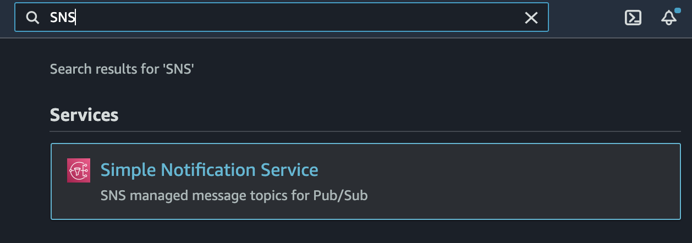

    2. On the right side provide the topic name and click Next step

       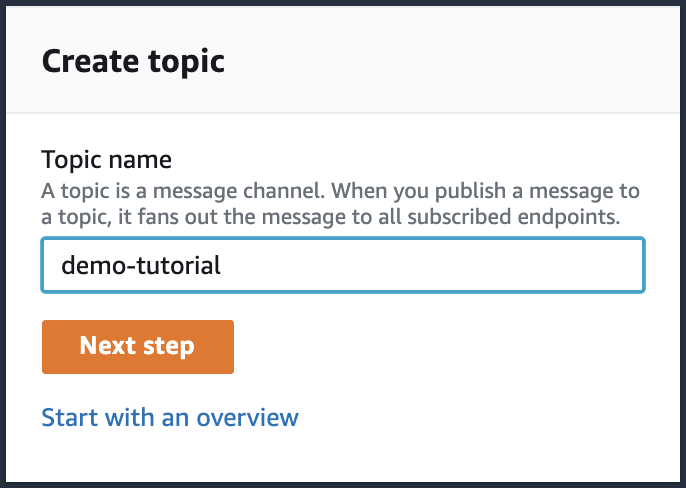

    3. Provide SNS topic name and type as Standard, leave rest as default

        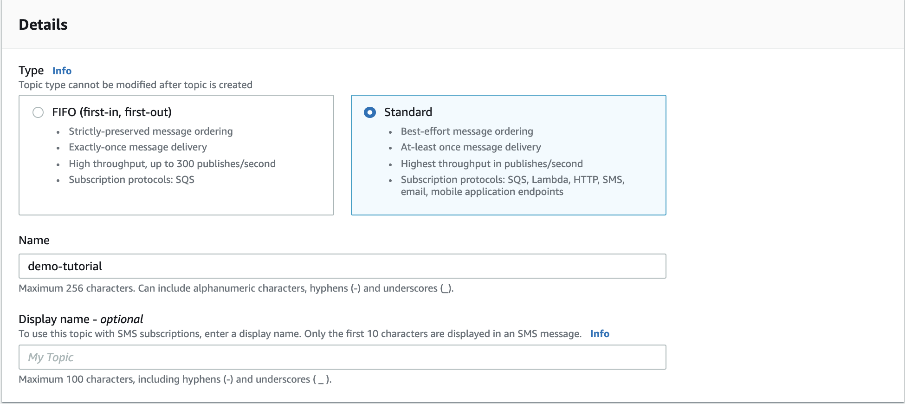

    4. Scroll down the page and select Create topic

        

    5. Next let's register subscription under the SNS topic created above, Select Create Subscription

        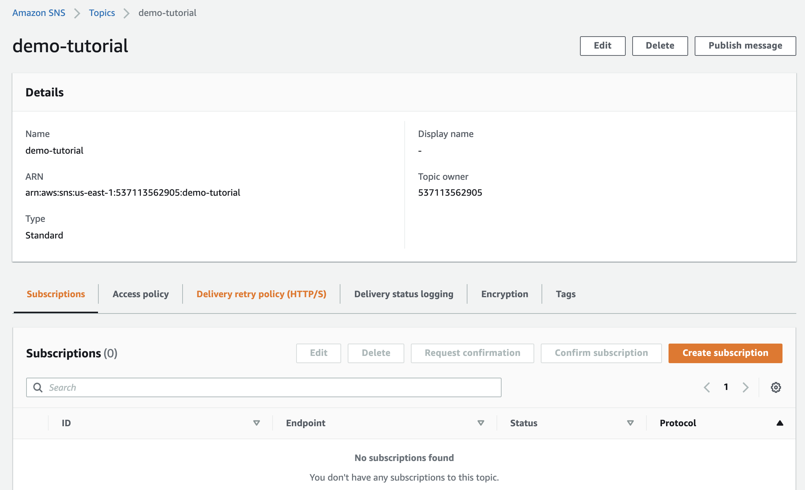

    6. Select Email as an option from Protocol drop-down list and provide your email address 

         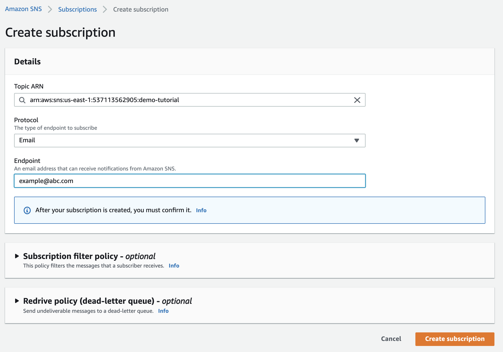

    7. Leave rest as default, scroll down and click Create Subscription

         

    8. Post that confirms your subscription via subscription email you would have received on the email id provided in Step 6

        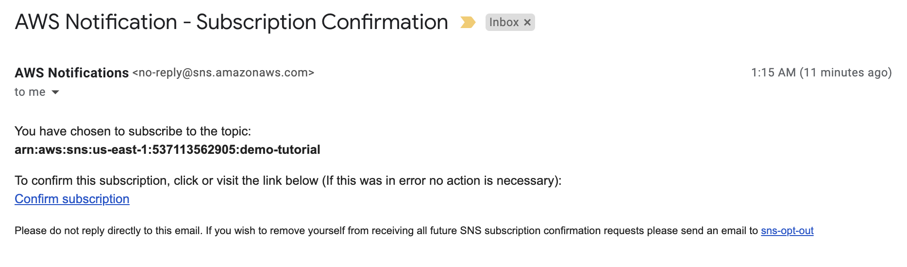

        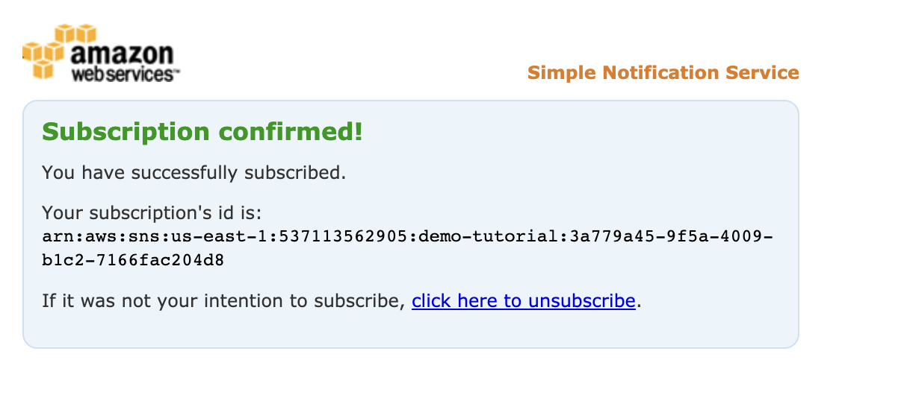

- Step 2: Deploy Amazon EventBridge and define the rule

    1. Navigate to Amazon EventBridge  

       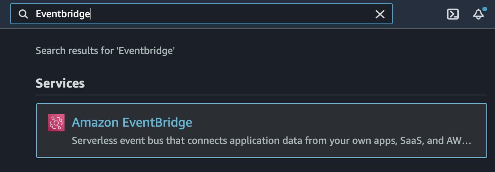

    2. Select Rules in the left pane or Select Create rule button on the right side from the Amazon EventBridge home screen

       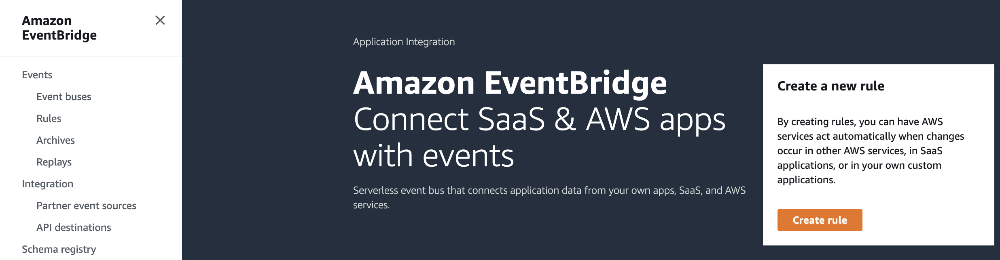

    3. Set up the Rule using the below settings
        - Enter a Name for the rule (e.g. AttachUserPolicy_Event)

            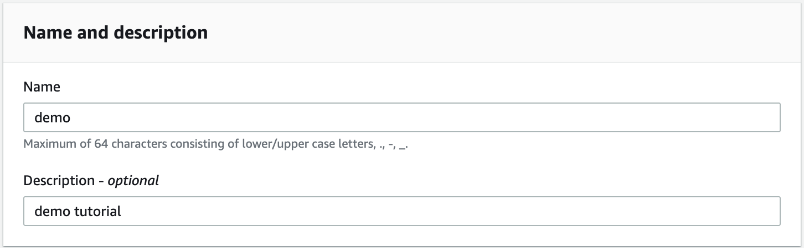

        - Event Pattern:
            - Pre-defined pattern by service
            - Service provider: AWS
            - Service Name: IAM
            - Event Type: AWS API Call via CloudTrail
            - Specific operation(s): AttachUserPolicy

            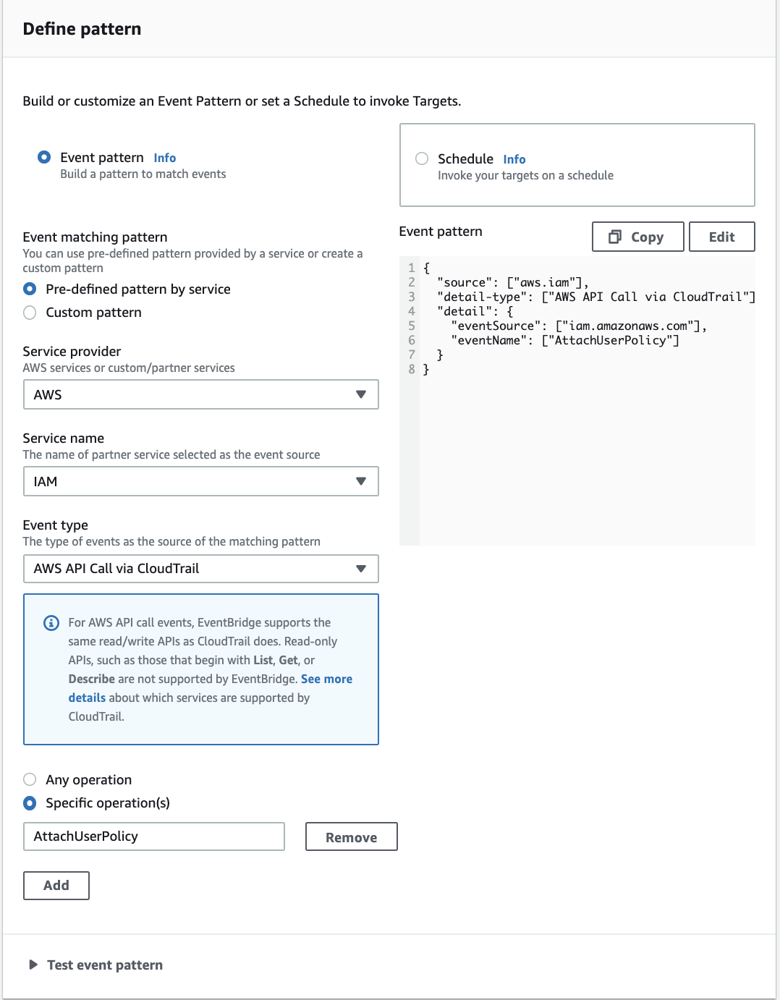

    4. Targets: SNS topic - Topic: demo-tutorial

       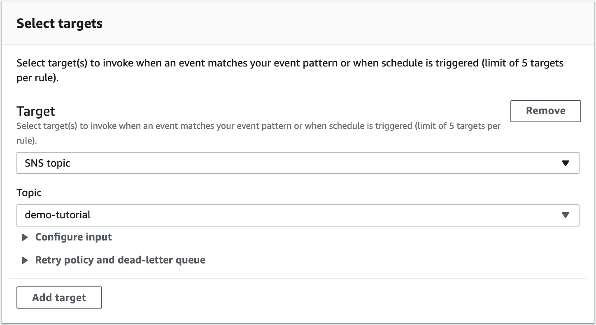
    
    5. Click Create and you will find the rule configured.

       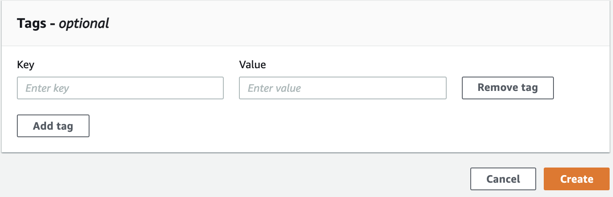

       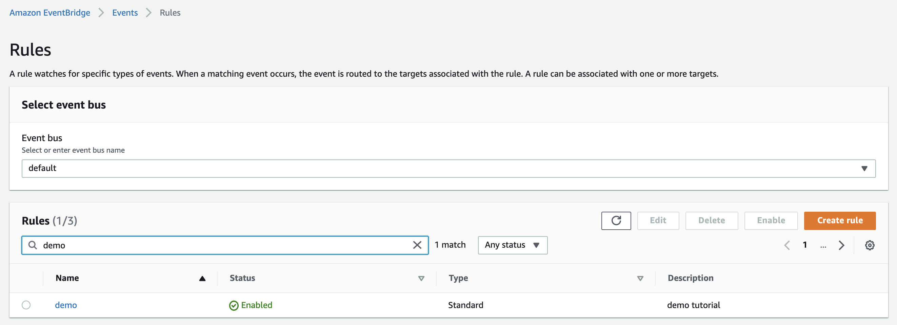
