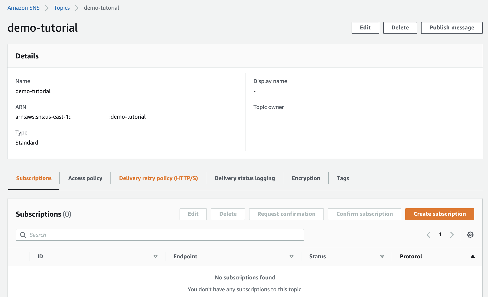
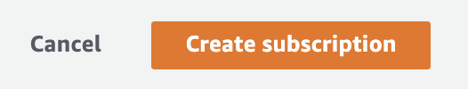
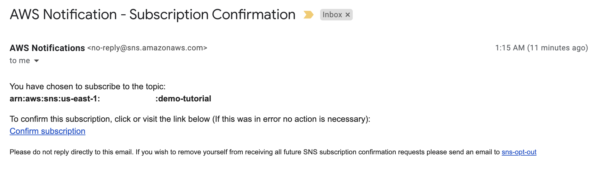
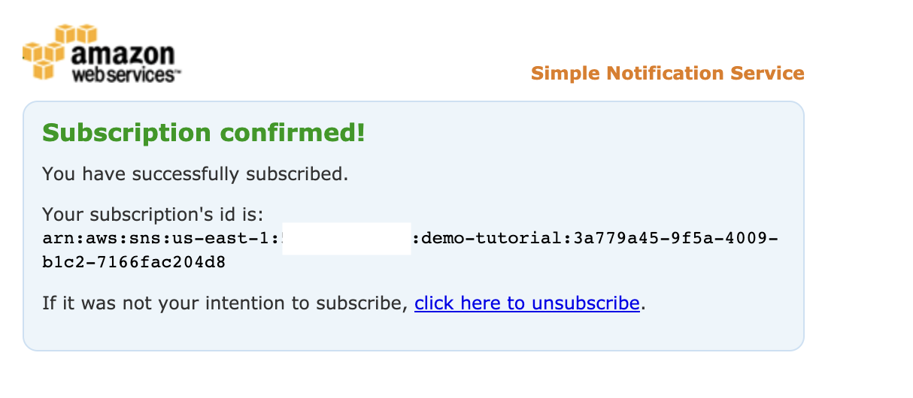

## Alerts with Amazon EventBridge

**Introduction**
- EventBridge reduces the process of constructing an event-driven platform. EventBridge, decouple the destination from the source of the event, and this way you can refine and publish directly to EventBridge. There is no configuration needed. Improve developer agility as well as application resiliency with decoupled event-based architectures.
- EventBridge bridge applications based on events. An event is an alert that a system’s state has changed. Customers can set up the own AWS applications with microservices, SaaS applications, and custom applications as event sources that publish events to an event bus. You can state a filtering rule to refine events and target events to AWS services and API destinations (via HTTP endpoint). 
- EventBridge schema registry persist schema produced by your applications, AWS services, or SaaS applications which contains information like the title, format, and validation rules for event data. You can download code bindings for any schema in the registry in your IDE and directly use the strongly-typed object representing the event in your code

**Tutorial**
- This tutorial, will leverage Amazon EventBridge to track and notify when an IAM policy is attached to an IAM user. The EventBridge Rule configured will track for a specific event name in CloudTrail, and will use an SNS message to notify regarding and event, when it occurs.

- Step 1: Deploy SNS and register an email based Subscription 

    1. Navigate to Amazon SNS  

       

    2. On the right side provide topic name and click Next step

       

    3. Provide SNS topic name and type as Standard, leave rest as default

        

    4. Scroll down the page and select Create topic

        

    5. Next let's register subscription under SNS topic created above, Select Create Subscription

        

    6. Select Email as option from Protocol drop down list and provide your email address 

         

    7. Leave rest as default, scroll down and click Create Subscription

         

    8. Post that confirm your subscription via subscription email you would have received on the email-id provided in the Step 6

        

        

- Step 2: Deploy Amazon EventBridge and define the rule

    1. Navigate to Amazon EventBridge  

       

    2. Select Rules in the left pane or Select Create rule button on the right side from Amazon EventBridge home screen

       

    3. Set up the Rule using the below settings
        - Enter a Name for the rule (e.g. AttachUserPolicy_Event)

            

        - Event Pattern:
            - Pre-defined pattern by service
            - Service provider: AWS
            - Service Name: IAM
            - Event Type: AWS API Call via CloudTrail
            - Specific operation(s): AttachUserPolicy

            

    4. Targets: SNS topic - Topic: demo-tutorial

       
    
    5. Click Create and you will find the rule configured.

       

       
